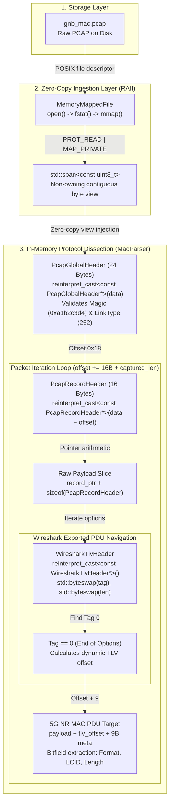
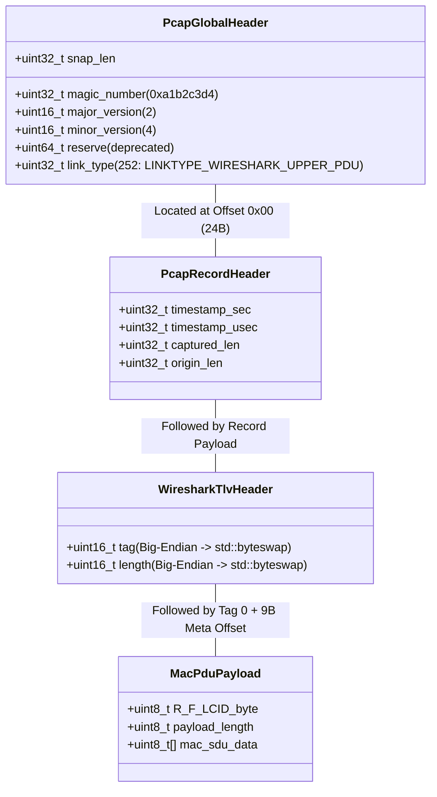

# 5G Fast Packet Parser

A high-performance C++23 parser designed to extract and decode 5G NR MAC Protocol Data Units (PDUs) from raw PCAP captures. Built for high-throughput packet processing environments (simulating a 100MHz 4x2 cell bypassing the OCUDU core network), it demonstrates zero-copy packet ingestion, packed structure memory mapping, and bit-level protocol dissection.

---

## System Architecture & Zero-Copy Pipeline

The parser avoids user-space buffer allocations and payload copies by mapping PCAP files directly into process virtual address space via POSIX `mmap`. Memory spans (`std::span`) provide safe, bounded views, allowing packed struct overlays (`reinterpret_cast`) and pointer arithmetic to traverse nested protocol headers.



---

## Detailed Memory Layout & Struct Mapping

Below is the byte-level mapping applied directly to the contiguous mapped memory:



---

## Technical Deep-Dive

### 1. Memory-Mapped File Ingestion (Zero-Copy)
File descriptors are obtained via `open()` and sized using `fstat()`. The memory region is mapped using `mmap()` with `PROT_READ | MAP_PRIVATE`. Complete resource lifecycle is strictly bound to RAII semantics inside `MemoryMappedFile`, executing `munmap()` and `close()` upon destruction.

### 2. Non-Owning Memory Views (`std::span`)
Instead of copying buffers into `std::vector` or raw dynamically allocated arrays, `MemoryMappedFile::file_reader()` returns a `std::span<const uint8_t>`. This gives safe array-indexing semantics, bounds checking, and iterator support without duplicating a single byte in memory.

### 3. Packed Struct Overlays via `reinterpret_cast`
All packet headers use GCC packed attributes (`__attribute__((__packed__))`) to eliminate structure padding and ensure memory alignment matches the binary specification on disk:
```cpp
const PcapRecordHeader* record_header =
    reinterpret_cast<const PcapRecordHeader*>(m_data.data() + current_offset);

const uint8_t* payload_ptr =
    reinterpret_cast<const uint8_t*>(record_header) + sizeof(PcapRecordHeader);
```

### 4. Endianness Conversion & TLV Navigation
Wireshark encapsulates 5G upper layers in Exported PDU TLV blocks encoded in Network Byte Order (Big-Endian). Using C++23 `<bit>` (`std::byteswap`), headers are converted to host byte order on the fly to dynamically navigate variable-length tags until encountering the `0` (End of Options) terminator tag.

### 5. 5G NR MAC PDU Dissection
Once past the 9-byte MAC-NR metadata header, bit masking extracts the 3GPP TS 38.321 header fields:
- **R (Reserved bit)**: `(first_byte & 0b10000000U) >> 7`
- **F (Format bit)**: `(first_byte & 0b01000000U) >> 6`
- **LCID (Logical Channel ID)**: `first_byte & 0b00111111U`

---

## Build & Verification

Requirements:
- C++23 compliant compiler (`g++-13` / `clang++-16` or newer)
- CMake 3.20+

```bash
# Generate build files and compile
mkdir -p build && cd build
cmake ..
make

# Run the parser against the captured PCAP trace
./parser
```

---

## Roadmap
- [x] Phase 1: Zero-copy file mapping (`mmap`) & Global PCAP Header validation
- [x] Phase 2: Record iteration & C++23 byte-swapping
- [x] Phase 3: Wireshark Exported PDU TLV decoding & raw 5G MAC PDU isolation
- [ ] Phase 4: Full 3GPP TS 38.321 MAC subPDU and SDU decoding table implementation
