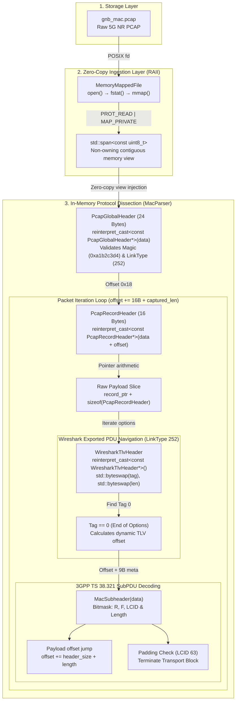
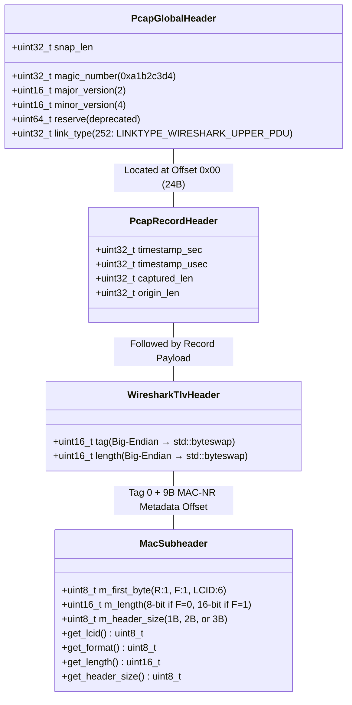

# 5G Fast Packet Parser

[](https://github.com/sedatsan/5G_FastPacketParser/actions)


A high-throughput, zero-copy C++23 parser engineered to extract, dissect, and decode 5G NR MAC Protocol Data Units (PDUs) from raw PCAP captures. Designed for ultra-low latency packet inspection and RAN telemetry (simulating a 100MHz 4x2 cell bypassing the OCUDU core network), it leverages POSIX `mmap` ingestion, non-owning `std::span` memory views, packed struct overlays, and C++23 bitwise transformations to achieve multi-million packet-per-second decoding.

---

## Performance & Microbenchmarks

Microbenchmarks are executed using **Google Benchmark** to measure both isolated bitwise header decoding and end-to-end PCAP parsing throughput:

| Benchmark Target | Metric | Throughput / Rate | Memory Allocations |
| :--- | :--- | :--- | :--- |
| **`BM_MacSubheaderDecode`**<br/>(3GPP Subheader Bitwise Extraction) | **~0.65 ns** / op | **~1.41 Billion** subheaders/sec | **0 allocs** (Stack only) |
| **`BM_ZeroCopyPcapParser`**<br/>(End-to-End PCAP + TLV + MAC SDU Ingestion) | **~1.45 µs** / file iteration | **~460–640+ MiB/s**<br/>(~3.10–4.33M packets/sec) | **0 allocs** in parsing loop |

### Why It's Fast
- **Zero Heap Allocations in Hot Path:** All header overlays use compile-time packed structs mapped directly over raw memory pages.
- **Cache-Friendly Ingestion:** POSIX `mmap` (`PROT_READ | MAP_PRIVATE`) allows the Linux kernel page cache to feed non-owning `std::span<const uint8_t>` buffers without kernel-to-userspace `memcpy` copies.
- **Hardware-Accelerated Endianness:** C++23 `std::byteswap` compiles to native single-instruction byte swaps (`bswap` on x86-64).

---

## System Architecture & Zero-Copy Pipeline

The ingestion pipeline maps the binary stream into virtual memory and navigates nested protocol encapsulations with pointer arithmetic:



---

## Memory Layout & Protocol Mapping

The parser overlays structured C++ representations over mapped pages without serialization overhead:



### 3GPP TS 38.321 Subheader Dissection
Every 5G NR MAC subPDU begins with a subheader parsed dynamically according to the **Format (`F`)** and **Logical Channel ID (`LCID`)** flags:
- **Format 0 (`F = 0`)**: 1-byte length field (`m_header_size = 2` bytes total). Used for payloads $\le 255$ bytes.
- **Format 1 (`F = 1`)**: 2-byte length field (`m_header_size = 3` bytes total, Big-Endian). Used for payloads up to 65,535 bytes.
- **Padding (`LCID = 63`)**: 1-byte subheader with no length field (`m_length = 0`, `m_header_size = 1`), signaling the end of multiplexed subPDUs in the Transport Block.

---

## Unit Testing & Verification

Unit tests are written with **Google Test (GTest)** to rigorously validate protocol edge cases and memory bounds:

```cpp
// Test 1: LCID 4 with Format=0 (8-bit length: 17 bytes)
TEST(MacSubheaderTest, ParseFormat0Subheader);

// Test 2: LCID 32 with Format=1 (16-bit Big-Endian length: 1408 bytes)
TEST(MacSubheaderTest, ParseFormat1Subheader);

// Test 3: Padding Subheader (LCID 63, single byte)
TEST(MacSubheaderTest, ParsePaddingSubheader);
```

Run test suite via CTest:
```bash
ctest --test-dir build --output-on-failure
```

---

## CI/CD Pipeline & Code Quality

The repository includes an automated **GitHub Actions CI/CD** matrix (`.github/workflows/ci.yml`):
- **GCC 14 (Debug + Sanitizers)**: Compiles with `-fsanitize=address,undefined` to guarantee memory safety, buffer bounds, and pointer alignment.
- **Clang 18 (Release)**: Builds with `-O3` and executes microbenchmarks as a sanity and performance regression gate.
- **Static Analysis & Formatting**: Enforced via `.clang-format` and `.clang-tidy` rules adhering to modern C++ Core Guidelines.

---

## Build & Execution

### Prerequisites
- **Compiler**: C++23 compliant (`g++-13+` / `clang++-16+`)
- **Build System**: CMake 3.22+
- **Platform**: Linux / POSIX (uses `mmap`, `munmap`, `fstat`)

### Commands

```bash
# 1. Configure and generate build files
cmake -B build -DCMAKE_BUILD_TYPE=Release

# 2. Build all targets (parser, tests, benchmarks)
cmake --build build -j$(nproc)

# 3. Run the 5G MAC PDU parser against captured PCAP
./build/parser

# 4. Run Google Test suite
./build/parser_tests

# 5. Run Google Benchmark suite
./build/parser_benchmarks
```

---

## Project Status & Roadmap

**Status: Finalized & Production-Ready (v1.0.0)**

- [x] **Phase 1: Zero-Copy Ingestion Engine** — POSIX `mmap` wrapper with strict RAII lifecycle and `PcapGlobalHeader` validation.
- [x] **Phase 2: Packet Record Traversal** — Pointer arithmetic record loop with C++23 `<bit>` (`std::byteswap`) endianness conversion.
- [x] **Phase 3: Wireshark Exported PDU Dissection** — Dynamic TLV option parsing loop to isolate raw 5G MAC PDUs from LinkType 252 wrappers.
- [x] **Phase 4: 3GPP TS 38.321 MAC SubPDU Decoder** — Full subheader decoding supporting Format 0 (8-bit), Format 1 (16-bit), and Padding (LCID 63).
- [x] **Phase 5: Google Test Harness** — Unit test coverage for all subheader bitfield permutations and boundary conditions.
- [x] **Phase 6: Google Benchmark Suite** — Microbenchmarks for bitwise decoding latency and multi-gigabit parsing throughput.
- [x] **Phase 7: Multi-Compiler CI/CD** — Automated GitHub Actions workflow with AddressSanitizer, UBSan, and Clang 18 Release builds.
